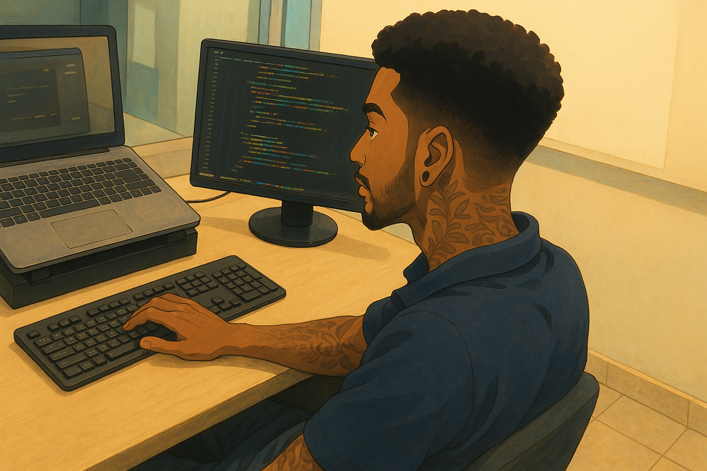
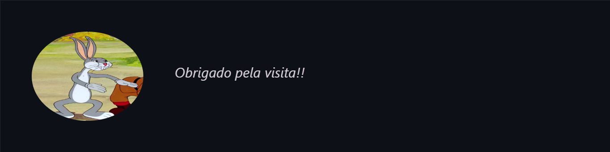

   

  

 

---

### Quem sou eu?

Sou formado em **Análise e Desenvolvimento de Sistemas** pela Athon - Ensino Superior e atualmente atuo como **Desenvolvedor Full Stack**.

No meu trabalho atual, participo de projetos de melhoria contínua, transformando processos manuais em soluções web integradas. Essa vivência me proporciona experiência prática tanto no **back-end** quanto no **front-end**, além de um bom domínio em **banco de dados** e **versionamento de código**.

Atualmente, estou focado em evoluir na stack **Python**, ampliando meus conhecimentos e buscando crescimento profissional nessa área.
 

---

### Sobre mim

  🧠 &nbsp; Estou sempre em busca de novos aprendizados e oportunidades para crescer como dev 
  💪🏾 &nbsp; Musculação é meu reset diário e me ensina disciplina 
  🎧 &nbsp; Viciado em música — seja pra focar ou viajar nas ideias 
  ☕ &nbsp; Não vivo sem um cafézinho

 

---

### 🌐 Onde me encontrar

  
  
  

 

---

 

  
  

 

---

---

 

  

